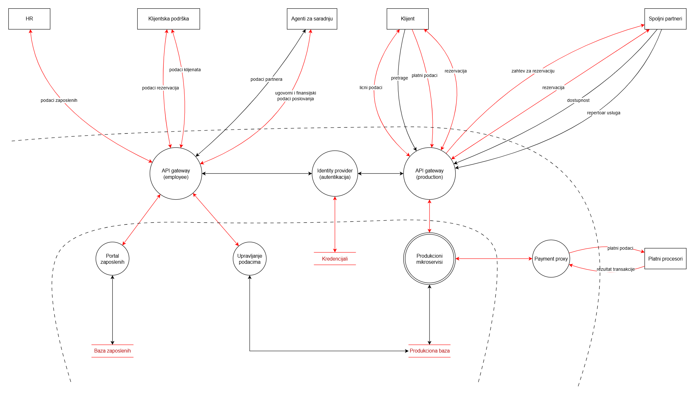

## A. Napadači i motivacija

| Klasa        | Veština           | Resursi             | Nivo pristupa | Krajnji ciljevi                            |
| ------------ | ----------------- | ------------------- | ------------- | ------------------------------------------ |
| rekreativci  | amateri           | ograničeni          | eksterni      | sticanje reputacije, rešavanje izazova     |
| insajderi    | varira            | ograničeni          | interni       | trgovina podacima, sabotaža                |
| kriminalci   | napredni          | srednji             | eksterni      | trgovina podacima, iznuđivanje, vandalizam |
| aktivisti    | napredni          | srednji             | eksterni      | sabotaža, vandalizam                       |
| teroristi    | napredni/eksperti | obimni              | eksterni      | krađa podataka, targetovanje ljudi         |
| konkurencija | napredni/eksperti | obimni/neograničeni | varira        | sabotaža, špijunaža                        |
| vlade        | eksperti          | neograničeni        | varira        | nadgledanje, krađa podataka, sabotaža      |

## B. Imovina

- pravni rizik
- gubitak novca
- gubitak reputacije

### 1. Podaci o zaposlenima

#### **Inherentna izloženost**:
- HR
- menadžment
- IT odeljenje
- odeljenje finansija

| Bezbednosni cilj | Uticaj oštećenja cilja                                                      |
| ---------------- | --------------------------------------------------------------------------- |
| poverljivost     | šteta na reputaciju, targetiranje zaposlenih (od javnosti ili konkurencije) |
| integritet       | gubitak poverenja zaposlenih                                                |
| dostupnost       | kašnjenje odeljenja finansija (legalne akcije zaposlenih)                   |

### 2. Pristupni podaci zaposlenih i autentikacija za infrastrukturu

#### **Inherentna izloženost**
- zaposleni (svoje podatke)
- administratori sistema/baze
- DevOps (infrastruktura, API ključevi, secrets)

(1) **Gubitak poverljivosti ove imovine može da za rezultat ima kompromitovanje većine ostale ugrožene imovine** (šteta zavisi od nivoa pristupa zaposlenog čiji pristupni podaci su ukradeni).

| Bezbednosni cilj | Uticaj oštećenja cilja                                                       |
| ---------------- | ---------------------------------------------------------------------------- |
| poverljivost     | (1)                                                                          |
| integritet       | stopiranje rada zaposlenih, onesposobljavanje infrastrukture (secrets, APIs) |
| dostupnost       | isto                                                                         |

### 3. Lični podaci i kredencijali klijenata

#### **Inherentna izloženost**:
- klijenti (svoje podatke)
- zaposleni koji asistiraju klijentima (agenti, podrška, odeljenje finansija)
- administratori sistema/baze

| Bezbednosni cilj | Uticaj oštećenja cilja                          |
| ---------------- | ----------------------------------------------- |
| poverljivost     | značajna šteta na reputaciju, gubitak klijenata |
| integritet       | stopiranje korišćenja usluga sistema            |
| dostupnost       | isto                                            |

### 4. Rizična intelektualna svojina i poslovne tajne

#### **Inherentna izloženost**:
- programeri i DevOps (izvorni kod aplikacije)
- menadžment
- odeljenje finansija
- administratori sistema/baze

| Bezbednosni cilj | Uticaj oštećenja cilja                                                                       |
| ---------------- | -------------------------------------------------------------------------------------------- |
| poverljivost     | značajna finansijska šteta na duže staze, gubitak prednosti nad konkurencijom, pravni rizici |
| integritet       | gubitak poverenja partnera i korisnika                                                       |
| dostupnost       | pravni rizici (gubitak dokumenata), stopiranje poslovnog razvoja                             |

### 5. Tehnička infrastruktura

#### **Inherentna izloženost**:
- administratori sistema
- DevOps

| Bezbednosni cilj | Uticaj oštećenja cilja                                                                            |
| ---------------- | ------------------------------------------------------------------------------------------------- |
| poverljivost     | rizik od napada na infrastrukturu                                                                 |
| integritet       | onesposobljivanje sistema (uživo), smanjivanje performansi korišćenja sistema (denial of service) |
| dostupnost       | isto                                                                                              |

## C. Površina napada

### Ljudski faktori

- klijenti
  - phishing (lažni emailovi, lažna klijentska podrška)
  - slabe lozinke (kratke, lako se pogode)

- zaposleni
  - phishing (lažni interni emailovi)
  - društveni inženjering (intelektualna svojina kompanije, poverljive informacije)
  - zloupotreba radnog mesta (privilegije, insider pretnje)

- spoljni partneri
  - pristup poslovnim tajnama (ugovori, strategije poslovanja)

### Digitalni faktori

- eksterni softver i servisi
  - hosting (serveri)
  - baze podataka
  - nesigurni logovi
  - komunikacija (email, chatovi)
  - finansije (platni procesori)

- aplikacioni softver
  - nezaštićeni servisi (backend)
  - web aplikacija (XSS, IDOR, iframe phishing)
  - interna baza podataka (nekriptovani podaci, SQL injection)
  - mane u autentikaciji i autorizaciji

- mrežni pristup (VPN)

### Fizički faktori

- lokacija (kancelarije, serveri, interni dokumenti)
- oprema zaposlenih (radne stanice, telefoni, USB)
- WiFi zaposlenih (udaljeni rad)

## D. Dijagrami toka podataka

### Context diagram

### Level 1 diagram

## E. Analiza pretnji i mitigacije

### Lažno predstavljanje (spoofing)

#### Od zaposlenih ka DMZ

- HR → Employee API gateway
  - Lažni HR nalog pristupa i upravlja privatnim podacima zaposlenih
- Klijentska podrška → Employee API gateway
  - Napadač imitira agenta podrške i time dobija CRUD nad klijentima ili rezervacijama
- Agenti za saradnju → Employee API gateway
  - Lažni agent dobija CRUD pristup podacima poslovnih partnera
  - Lažni agent dobija pristup osetljivim podacima ugovora sa partnerima i podacima poslovanja

Mitigations: MFA, SSO i IP restrikcije (samo iz mreža kompanije)

#### Od klijenata i spoljnih partnera ka DMZ

- Klijent → Production API gateway
  - Napadač se predstavlja kao neko i upravlja podacima klijenta i zahtevima rezervacija
- Spoljni partner → Production API gateway
  - Neko imitira partnera: upravlja statusima rezervacija i dostupnim uslugama

Mitigations: MFA, TLS i Certificates za spoljne partnere

#### Od platnih procesora ka DMZ

- Platni procesor → Payment proxy
  - Lažni platni procesor prikuplja platne podatke klijenata ili šalje lažne rezultate transakcija

Mitigations: mutual TLS i enkripcija podataka

#### DMZ procesi međusobno i ka internim procesima

- API gateways → IDP
  - Lažni gateway pokušava da se predstavi IDP
- Payment proxy → Produkcioni mikroservisi
- IDP → baza kredencijala
  - Lažni IDP pokušava da čita i upisuje u bazu kredencijala

Mitigations: mutual TLS i IP restrikcije

### Izmena podataka (Tampering)

- HR → Employee API → IDP → Portal zaposlenih → Baza zaposlenih
- Klijentska podrška → Employee API → IDP → Upravljanje podacima → Produkciona baza
- Agenti za saradnju → Employee API → IDP → Upravljanje podacima → Produkciona baza
- Klijenti → Production API → IDP → Mikroservisi
- Klijenti → Production API → IDP → Mikroservisi → Payment Proxy → Platni procesori
- Platni procesori → Payment Proxy → Mikroservisi
- Platni procesori → Payment proxy → Mikroservisi
- Spoljni partneri → Production API → IDP → Mikroservisi

Mitigations: End-to-end enkripcija (TLS), parametrizovani upiti (SQL-injection), write-ahead-logs

### Poricanje radnji (Repundation)

- Zaposleni i HR koji menjaju svoje ili tuđe podatke
- Klijenti i spoljni partneri koji menjaju svoje podatke ili poriču ugovore
- Agenti za saradnju sa partnerima poriču da su uneli određene ugovorne podatke

Mitigations: audit logovi sa timestampom

### Otkrivanje podataka (Information disclosure)

- Lični podaci klijenata koji mogu da procure tokom slanja
- Lični podaci zaposlenih koji mogu da procure
- Platni podaci koji budu kompromitovani prilikom procesa
- Detalji o poslovnim tajnama i ugovorima koji budu presrednuti

Mitigations: End-to-end enkripcija (TLS), maskiranje osetljivih podataka

### Denial of Service (DoS)

- Preopterećenje Employee API gateway i onemogućivanje rada
- Preopterećenje Production API gateway
- Prevelik broj zahteva ka IDP

Mitigations: rate limiting, throttling, horizontalno skaliranje i kontrola IP adresa (gateways ka IDP)

### Eskalacija privilegija

- HR i zaposleni koji zloupotrebljuju pristup sistemu i kontrolišu podatke i servise
- Klijenti i spoljni partneri koji dobiju interni pristup (DMZ) ili kontrolu nad podacima

Mitigations: RBAC, ABAC i dobra segregacija uloga
