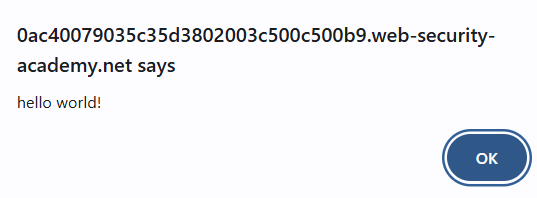

## SQL Injection (SQLi)
**SQL Injection** spada u server-side napade. Prilikom **SQLi** napadač unosi SQL upit umesto unosa običnog teksta sa ciljem da se taj upit izvrši na bazi i da dobije pristup podacima koje inače ne bi mogao da vidi niti da upravlja njima. Osim podacima, može dobiti pristup i celim tabelama i kolonama, i da vrši sve operacije nad njima. 

**SQLi** je opasan jer napadač može dobiti pristup bitnim podacima poput lozinki, podataka s kreditnih kartica i ličnih podataka korisnika. Mogao bi da ih vidi, menja, upisuje, briše... **SQLi** utiče na reputaciju aplikacije i košta. U nekim slučajevima napadač može i da dobije backdoor u sistem koji može dugo biti nezapažen i time ga kompromiše.

Aplikacija je ranjiva na **SQLi** ukoliko ne vrši neophodne validacije, korisnicima daje previše dozvola i koriste se konkatenacija stringa na query. Na primer: 

        String query = "SELECT account_balance FROM user_data WHERE user_name = "
                + request.getParameter("customerName");
    try {
        Statement statement = connection.createStatement( ... );
        ResultSet results = statement.executeQuery( query );
    }

U ovom slučaju problem pravi nevalidacija *customerName* koji se append-uje na query. Napadač može da prosledi kod koji će se nadovezati na ovaj query i izvršiti nad bazom. 

Česti primeri **SQLi** su:
- Preuzimanje skrivenih podataka, SQL query se modifikuje kako bi se vratili dodatni podaci.
- Podmetanje logike aplikaciji, query se modifikuje kako bi se izmenila logika aplikacije.
- UNION napadi, vraćanje podataka iz različitih tabela baze.
- Blind SQLi, koristi se kada aplikacija pokazuje generic error poruke, ali nije uklonjen kod koji je ranjiv na SQLi. Napadač pita bazu true false pitanja i naspram odgovora aplikacije zaključuje odgovor.

Prva opcija za izbegavanje **SQLi** napada je korišćenje parametrizovanih queries umesto konkatenacije. Parametarski queries se mogu koristiti u svakoj situaciji gde se nepoverljiv input korisnika koristi kao podatak unutar query-ja, uključujući **WHERE** klauzulu kao i **INSERT** ili **UPDATE** iskaze.
Primer ranjivog query-ja:

    String query = "SELECT * FROM products WHERE category = '"+ input + "'";
    Statement statement = connection.createStatement();
    ResultSet resultSet = statement.executeQuery(query);

Taj query bi mogao da se izmeni kako bi postao otporan: 

    PreparedStatement statement = connection.prepareStatement("SELECT * FROM products WHERE category = ?");
    statement.setString(1, input);
    ResultSet resultSet = statement.executeQuery();

Druga opcija za odbranu je *Stored Procedures*. *Stored procedure* je SQL kod koji možemo da sačuvamo, tako da možemo da ga koristimo više puta, samo ga pozovemo kako bi se izvršio. Takođe možemo da im prosledimo parametre. Iako nisu uvek sigurne od **SQLi**, developeri mogu koristiti određeni standard za njihovo pisanje. Najsigurniji način za njihovo pisanje je da se napišu SQL iskazi sa parametrima koji su automatski parametrizovani. Razlika izmedju ovog i prošlog prostupa je u tome što se *Stored procedures* definišu i čuvaju u samoj bazi pa se pozivaju iz aplikacije. Slučaj u kom mogu izazvati rizik od **SQLi** je ukoliko dodje do breach-a servera. 
 
Treća opcija za odbranu je *Allow-list validacija unosa*.Paramtrizovanje query-ja ne bi radilo ukoliko je neophodno da se nepoverljiv input korisnika koristi kao naziv tabele ili kolona, ili u **ORDER BY** klauzuli. U ovim slučajevima bi morao da se koristi drugačiji pristup poput *Allow-list validacija unosa* ili izmena same logike. *Allow-list* je u suštini lista dozvoljenih opcija koju vrednost koju unosimo može da ima. Na primer:

    String tableName;
    switch(PARAM):
    case "Value1": tableName = "fooTable";
                    break;
    case "Value2": tableName = "barTable";
                    break;
    ...
    default      : throw new InputValidationException("unexpected value provided" 
                            + " for table name");
*Allow-list validacija unosa* se takođe može koristiti pre samog slanja unosa korisnika tako što se validiraju unosi po sintaksi i semantici. Korisnik ne bi smeo da pošalje upit ukoliko sadrži neke od znakova **SQLi** poput: 
- slanja samog znaka '
- sintakse SQL jezika
- Boolean iskaza poput 1=1 ili 1=2

Četvrta opcija je potpuno izbegavanje svih input-a korisnika, ovo nije preporučljivo jer ne može da garantuje potpunu zaštitu od **SQLi** i implementacija zavisi od korišćene baze.

Dodatna zaštita od **SQLi** se može postići pomoću smanjenja privilegija tako da sve vrste korisnika imaju minimalne neophodne privilegije za pristup bazi. Ukoliko bi korisnik trebao samo da čita odredjene podatke iz baze, potrebno je ograničiti  ga tako da je to sve što može da radi. Korisnik sme da radi samo ono što smo mu dozvolili. 

## Cross-site scripting (XSS)
**Cross-site** spada u client-side napade. Prilikom **XSS** napadač iskorišćava ranjive web sajtove i u njih injektuje maliciozni kod. Nakon što se taj kod izvrši, korisnikovo korišćenje tog sajta postaje kompromizovano. Korisnikov browser ne zna da je taj kod došao iz nepouzdanih izvora i izvršava injektovan kod. Maliciozna skripta ima pristup cookies, tokenima sesije i drugim osetljivim informacijama koje čuva browser i koje koristi na tom sajtu. Ove skripte mogu čak i da izmene sadržaj HTML stranice. 

Web stranica ili web aplikacija je ranjiva na **XSS** napada ukoliko koristi neproveren korisnički input u output-u koji generiše. Taj input dalje mora biti parsiran od strane browser-a žrtve.

Tipovi **XSS** napada:
- *Reflected XSS*
- *Stored XSS*
- *DOM-based XSS*

### *Reflected XSS* 
-Najjednostavniji tip **XSS**-a. Dešava se kada aplikacija primi podatke u vidu HTTP request-a i  iskoristi ih u okviru neposrednog odgovora na nebezbedan način. Reflektovnai napadi su poslati korisniku preko neke druge rute, poput e-mail poruke ili nekog drugog sajta. Kada korisnik klikne na maliciozan link, injektovan kod putuje ka ranjivom sajtu koji reflektuje napad nazad ka browser-u. Browser zatim izvršava taj kod. 
Na primer: 

    https://insecure-website.com/status?message=All+is+well.
    
Status: All is well.

Aplikacija ne procesuje podatke, pa napadač može lako da izvrši napad na sledeći način:

    https://insecure-website.com/status?message=
    
Status: 

Ukoliko korisnik poseti link koji je umetnuo napadač, izvršiće se umetnuta skripta u njegovom browser-a unutar korisničke sesije. U tom moemntu skripta može da izvrši bilo koju akciju i pokupi bilo koje podatke kojima korisnik ima pristup. 

### *Stored XSS*
-Dešavaju se kada aplikacija primi podatke od nepouzdanog izvora i uključi ih u kasnije HTTP response-ove na nebezbedan način. Kod ove vrste **XSS** napada, skripta se trajno čuva na ciljanim serverima, na primer u samoj bazi, u forumu, log-u poruka... Žrtva zatim izvrši skriptu kada zatraži pristup skladištenim podacima. Na primer:

Aplikacija sa oglasnom tablom daje korisnicima da unesu poruke koje se prikazuju drugim korisnicima:

    
Hello, this is my message!

Aplikacija dalje ne procesuje unete podatke, pa napadač može lako da pošalje poruku sa skriptom u sebi koja napada druge korisnike:

    

### *DOM-based XSS*
-Dešavaju se kada aplikacija ima JavaScript na klijentskoj strani koji procesuje podatke od nepouzdanog izvora na nebezbedan način. Maliciozna skripta se u potpunosti izvršava u browser-u  manipulacijom DOM-a stranice. Na primer:

Aplikacija koristi JavaScript da pročita unešenu vrednost iz polja za unos i ispiše je u elementu unutar HTML-a:

    var search = document.getElementById('search').value;
    var results = document.getElementById('results');
    results.innerHTML = 'You searched for: ' + search;

Ukoliko napadač kontroliše vrednost polja za unos, lako može da ubaci maliciozne vrednosti u njega:

    You searched for: 

Zaštita od **XSS** napada se može postići:
- *filtriranjem unosa nakon dolaska*, na tački gde se prima unos, strogo se filtrira tako da prima samo očekivane ili validirane vrednosti. 
- *enkodiranjem podataka na output-u*, na tački gde podaci koje je uneo korisnik vraćaju u HTTP response-ovima, enkodira se izlaz tako da se spreči njegova interpretacija kao da je aktivni sadržaj.
- *korišćenjem prikladnih response header-a*, kako bi se sprečio **XSS** u HTTP response-ovima koji nisu namenjeni da sadrže HTML ili JavaScript, mogu se koristiti *Content-type* ili *X-Content-Type-Options* header-i da se postaramo da će browser interpretirati response na način na koji mi želimo.
- *Content Security Policy*, kao poslednji red odbrane, može se koristiti *Content Security Policy* kako bi se smanjio rizik od **XSS** ranjivosti koje mogu da se dese. 

## SQLi zadaci:
1. *SQL injection vulnerability in WHERE clause allowing retrieval of hidden data*

    Prilikom menjanja kategorije, poziva se sledeći SQL:
    >SELECT * FROM products WHERE category = 'Gifts' AND released = 1
    
    Pomoću *Burp Suite* intercept-ujemo request stranice i vidimo filter koji se šalje.
    >GET /filter?category=Gifts

    Na taj filter dodajemo *'+OR+1=1--*. Pošto ovo dodajemo na mestu naziva kategorije potrebno je da stavimo ' kako bi zatvorili string ('Gifts'), OR 1=1 dodajemo zato što je to uvek tačno, a -- kako baza ne bi gledala ono što dolazi posle. Time dobijamo: 
    >SELECT * FROM products WHERE category = 'Gifts' OR 1=1 --AND released = 1

    Pošto je 1=1 uvek tačno, pokazaće nam se svi proizvodi iz svih kategorija, a *AND released = 1* će se ignorisati pa ćemo dobiti sve proizvode i koji jesu i koji nisu izašli.

    Ukoliko želimo da vidimo sve proizvode iz kategorije Gifts možemo umesto ovog dodati *'+--*, i onda bi SQL kod izgledao ovako:
    >SELECT * FROM products WHERE category = 'Gifts' --AND released = 1

    
    
---
2. *SQL injection vulnerability allowing login bypass*

    Ukoliko interceptujemo login pomoću Burp Suite, možemo videti kako se šalju username i password:
    >csrf=NzTrpznuYmiSE6AZRMXnLJ1j6QAJCJsT&username=username&password=password
    
    Ukoliko zamenimo unešen username sa *administrator'--*,
    uspećemo da se ulogujemo sa korisničkim imenom administrator bez lozinke. Pomoću navodnika zatvaramo string nakon administrator a -- nam služi da ignorišemo ostatak koda, tako da nam lozinka nije potrebna za login.
    >csrf=NzTrpznuYmiSE6AZRMXnLJ1j6QAJCJsT&username=administrator'--&password=password

    
    
    
---
3. *SQL injection UNION attack, determining the number of columns returned by the query*

    UNION operator zahteva da bude isti broj kolona u svim query-ima. Ukoliko uradimo:
    >'+UNION+SELECT+NULL--
    
    i posmatramo greške, možemo zaključiti broj kolona naspram toga koliko puta smo stavili NULL u query (NULL predstavlja kolonu). Ako stavimo jednom i nema greške, to znači da tabela ima jednu kolonu, ali ako ima greške to znači da ih ima više. Dodajemo NULL sve dok greške ne prestanu. U ovom slučaju greške su prestale nakon tri NULL vrednosti, što znači da tabela ima 3 kolone. 
    >'+UNION+SELECT+NULL,NULL,NULL--

    
    
    
---
4. *SQL injection UNION attack, finding a column containing text*

    Osim što UNION traži da bude isti broj kolona, takodje mora biti i isti tip. Kako bi pronašli koje kolone su kompatibilne sa tekstom, prvo moramo pronaći broj kolona. To radimo na isti način kao u prethodnom zadatku. 
    >'+UNION+SELECT+NULL,NULL,NULL--

    Kao i u prethodnom zadatku, možemo videti da tabela ima 3 kolone. Na sličan način proveravamo koje kolone su kompatibilne s tekstom, na mesta gde su NULL, sada stavljamo bilo koji string i ukoliko ne dobijemo grešku, ta kolona je kompatibilna s tekstom, a ukoliko je dobijemo, nije.
    >'+UNION+SELECT+'qwert',NULL,NULL--

    Grešku ne dobijamo ukoliko stavimo tekst na mesto druge kolone, time znamo da je druga kolona kompatibilna s tekstom. U zadatku se traži da nateramo bazu da vrati tekst 'zCPlQR', postižemo to tako što zamenimo drugo NULL s tim tekstom. 
    >'+UNION+SELECT+NULL,'zCPlQR',NULL--

    
    
    
    
    
    
    
    
---
5. *SQL injection UNION attack, retrieving data from other tables*

    U zadatku je rečeno da baza ima tabelu *users* sa kolonama *username* i *passwords*. To možemo i potvrditi tako što ponovimo prethodna dva zadatka. Izvršenjem ove komande, dobijamo vrednosti kolona *username* i *password* iz tabele *user*.

    >'+UNION+SELECT+username,+password+FROM+users--

    Za rešenje zadatka je potrebno da se ulogujemo kao administrator. Iz vraćenih podataka vidimo njegove kredencijale. 
    >Username = administrator, password = 3qshuqhd0jso5zh69uxg. 

    
    
    
    
    
---

## XSS zadaci:
1. *Reflected XSS into HTML context with nothing encoded*

    Polje za pretragu nije osigurano od XSS napada, potrebno je uneti alert unutar script tagova u njega kako bi rešili zadatak. Klikom na dugme Search dobijamo sam alert.

    
    
    
---
2. *Stored XSS into HTML context with nothing encoded*

    Zadatak je sličan kao prethodni samo što je umesto Reflected XSS napada, ovde Stored. Unosimo alert unutar komentara na blogu. Sada, svaki put kada se otvori taj blog i učitaju se komentari, iskočiće alert. 

    
    
    

---
3. *DOM XSS in document.write sink using source location.search inside a select element*

    Iz koda možemo videti da se vrednost promenljive *store* kupi iz parametara URL-a. Manipulacijom URL-a manipulišemo njenu vrednost.
    `var store = (new URLSearchParams(window.location.search)).get('storeId');`
    
    `if(store) {
        document.write('<option selected>'+store+'</option>');
    }`

    Ukoliko na URL dodamo *&storeId=qwert*, *store* dobija vrednost *qwert* i ta vrednost se upisuje kao opcija dropdown liste u HTML-u.

    `&storeId=</option></select>`

    Zatvaramo tagove option i select i dodajemo sliku koja izaziva grešku, a nakon što je izazove poziva alert.

    
    
    
    
    
---
4. *Reflected XSS in canonical link tag*

    Dodavanjem sledećeg koda u nastavak URL-a, podešavamo access key i šta se dešava nakon njegovog unosa.
    Pritiskanjem ALT+X na tastaturi poziva se alert. 
    >?'accesskey='x'onclick='alert(456)

    
    
---
5. *DOM XSS in AngularJS expression with angle brackets and double quotes HTML-encoded*

    Ukoliko uradimo inspect element na stranici, možemo videti da je na body tag dodat ng-app i da se ono što pretražujemo ispisuje unutar h1 taga na stranici. Zbog ng-app možemo izvršiti JavaScript kod ukoliko ga stavimo u {{}}. Zbog angulara ne možemo samo napisati {{alert(345)}}. Ovo možemo zaobići ukoliko pozovemo alert na poziv konstruktora.
    >{{$on.constructor('alert(345)')()}}

    
    
    
    
---

