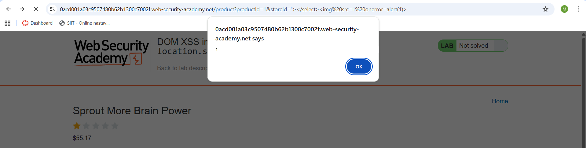
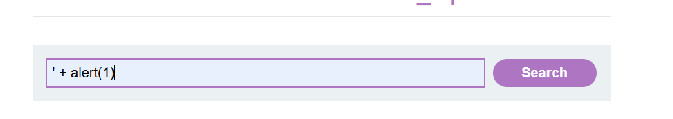
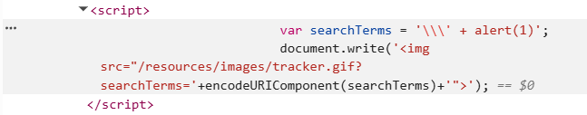

# Cross-Site Scripting (XSS)

## Šta je Cross-Site Scripting (XSS)?

Cross-site scripting (XSS) je bezbednosna ranjivost veb aplikacija koja omogućava napadaču da ubaci i izvrši **maliciozni JavaScript** u pregledaču žrtve.  
Na ovaj način napadač zaobilazi *same-origin policy* i može da kompromituje interakciju korisnika sa aplikacijom.  

Napadač može da:
- Izvršava akcije u ime korisnika.  
- Pristupi korisničkim podacima.  
- Ukoliko žrtva ima administratorske privilegije, preuzme kontrolu nad celom aplikacijom.  


## Kako XSS funkcioniše?

XSS radi tako što ranjiva aplikacija vrati korisniku **nefiltriran unos** kao deo HTML-a ili JavaScript-a. Kada se taj sadržaj učita u pregledaču, maliciozni kod se izvršava.  

Primer:  

```html
<script>alert("XSS");</script>
```

Ovaj payload izaziva izvršavanje JavaScript koda u pregledaču korisnika.  


## Vrste XSS napada

Postoje tri osnovne vrste XSS ranjivosti:

### 1. Reflected XSS
- Maliciozni skript dolazi direktno iz HTTP zahteva i odmah se vraća u odgovoru.  
- Tipično se dešava putem GET parametara.  

Primer:  
```
https://insecure-website.com/status?message=<script>alert(1)</script>
```

### 2. Stored XSS
- Maliciozni skript se trajno skladišti u bazi podataka i prikazuje svim korisnicima.  
- Primeri: komentari na blogu, chat poruke.  

```html
<p><script>alert("Hacked!");</script></p>
```

### 3. DOM-based XSS
- Ranljivost se nalazi u **klijentskom JavaScript kodu**.  
- Dolazi kada aplikacija nepravilno manipuliše DOM-om koristeći nefiltriran unos.  

Primer:  
```javascript
var search = document.getElementById('search').value;
document.getElementById('results').innerHTML = "You searched for: " + search;
```

Napadač može ubaciti:  
```html

```


## Uticaj XSS napada

Posledice zavise od aplikacije i privilegija korisnika, ali mogu uključivati:  
- **Krađu kolačića i sesija**.  
- **Lažiranje identiteta korisnika**.  
- **Prikazivanje lažnog sadržaja (defacement)**.  
- **Unošenje trojan funkcionalnosti** u aplikaciju.  
- **Potpuno kompromitovanje aplikacije** ako žrtva ima administratorske privilegije.  


## Kako sprečiti XSS?

Prevencija XSS zahteva kombinaciju tehnika:

### 1. Filtriranje ulaza
- Na ulazu dozvoljavati samo očekivane karaktere (*whitelisting*).  

### 2. Kodiranje izlaza
- Pre nego što se podatak prikaže u HTML, JavaScript ili CSS kontekstu, mora se **escape-ovati** ili enkodirati.  

### 3. Odgovarajući HTTP headeri
- `Content-Type` i `X-Content-Type-Options` sprečavaju da browser pogrešno interpretira sadržaj.  

### 4. Content Security Policy (CSP)
- Kao dodatna zaštita, CSP može značajno umanjiti posledice XSS-a ograničavanjem izvršavanja skripti.

# Zadaci

## **1. DOM XSS in `document.write` sink using source `location.search`**

Stranica se sastoji iz input polja, koja menja `source` slike u zavisnosti od vrednosti koju je korisnik uneo.
U normalnim okolnostima, korisnik bi uneo vrednost poput 'cat', nakon čega bi `img` tag izgledao ovako:

```html

```

Ovo možemo da iskoristimo tako što ćemo kao vrednost uneti sledeće

```html
"><svg onload=alert(1)>
```

<p align="center"></p>
<p align='center'><i>slika 1.1 - unos vrednosti</i></p>
<br/>


nakon čega će DOM izgledati ovako:
```html
    
    <svg onload=alert(1)>
```

<br/>
<br/>

<p align="center"></p>
<p align='center'><i>slika 1.2 - DOM stablo nakon unosa</i></p>

<br/>
<br/>

<p align="center"></p>
<p align='center'><i>slika 1.3 - Rezultat našeg unosa</i></p>

## **2. DOM XSS in jQuery anchor `href` attribute sink using `location.search` source**

Stranica na osnovu parametra `returnPath` menja `href` atribut 'Back' dugmeta. Ovo možemo upotrebiti tako što ćemo kao vrednost u URL-u proslediti Javascript kod.

<p align="center"></p>
<p align='center'><i>slika 2.1 - Primer ispravnog requesta</i></p>
<br/>
<br/>

<p align="center"></p>
<p align='center'><i>slika 2.2 - DOM stablo nakon ispravnog requesta</i></p>
<br/>
<br/>

<p align="center"></p>
<p align='center'><i>slika 2.3 - Primer requesta sa ubačenim Javascript kodom</i></p>
<br/>
<br/>

<p align="center"></p>
<p align='center'><i>slika 2.4 - Rezultat requesta sa ubačenim Javascript kodom</i></p>

## **3. DOM XSS in `document.write` sink using source `location.search` inside a select element**

Stranica na osnovu parametra `storeId` iz URL-a dodaje nove vrednosti u drop-down listu.

<p align="center"></p>
<p align='center'><i>slika 3.1 - Očekivano korišćenje parametra 'storeId'</i></p>
<br/>
<br/>

<p align="center"></p>
<p align='center'><i>slika 3.2 - vrednost iz storeId parametra je dodata u drop-down listu</i></p>
<br/>
<br/>

Slično prethodnim zadacima, ovo takođe možemo da iskoristimo da bismo izvršili proizvoljan Javascript kod. To ćemo postići ako izmenimo putanju tako da liči na sledeće:

```html
product?productId=1&storeId="></select>
```

Stranica će dodati sliku, pri čijem učitavanju će se izvršiti naš kod.

<p align="center"></p>
<p align='center'><i>slika 3.3 - rezultat izvršavanja umetnutog Javascript koda u URL putanji</i></p>


## **4. Reflected XSS into HTML context with all tags blocked except custom ones**

Ponekad veb aplikacije ne dozvoljavaju dodavanje običnih HTML tagova. Ako bi pokušali metode koje smo koristili u nekom od prethodnih zadataka, dobili bismo grešku.

<p align="center"></p>
<p align='center'><i>slika 4.1 - Unos vrednosti kako bi se ubacio proizvoljni HTML tag</i></p>
<br/>
<br/>

<p align="center"></p>
<p align='center'><i>slika 4.2 - greška jer uneti tag nije dozvoljen</i></p>
<br/>
<br/>

U ovakvim slučajevima, možemo da pokušamo dodavanje custom tagova

```html
<custom-tag onfocus='alert(document.cookie)' id='x' tabindex='1'>
```
Našem custom tagu ćemo dodati određene atribute. Cilj nam je da se naš kod izvrši unutar `onfocus` eventa. Međutim, osim određenih polja poput input-a, ne mogu svi HTML elementi da uđu u focus po default-u. Zbog toga dodajemo `tabindex` atribut, koji dodaje tu funkcionalnost našem atributu. Takođe dodeljujemo i `id` našem atributu, kako bismo mogli da ga targetujemo. 

Kada unesemo naš custom tag, dobićemo url koji mu odgovara. Preostaje još da na njegov kraj dodamo `#x`, čime targetujemo naš custom tag pomoću njegovog id-a i on dobija focus.

<p align="center"></p>
<p align='center'><i>slika 4.3 - unos custom taga</i></p>
<br/>
<br/>

<p align="center"></p>
<p align='center'><i>slika 4.4 - rezultat izvršavanja našeg koda</i></p>
<br/>
<br/>

Postoji i drugi način da se reši ovaj zadatak koji je obavezan kako bi ga platforma detektovala kao uspešno odrađenog. Ideja oba načina je ista.

<p align="center"></p>
<p align='center'><i>slika 4.5 - rešavanje istog zadatka preko burp suit-a</i></p>
<br/>
<br/>

## **5. Reflected XSS into a JavaScript string with single quote and backslash escaped**

Jedan vid odbrane od ovog napada jeste "escapovanje" specijalnih karaktera poput `'` ili `\`

Pre svega, pokušajmo da ubacimo naš javascript kod sa pretpostavkom da aplikacija nema implementirane tehnike odbrane od ovog napada.

<p align="center"></p>
<p align='center'><i>slika 5.1 - unos normalnih vrednosti</i></p>
<br/>
<br/>

<p align="center"></p>
<p align='center'><i>slika 5.2 - script tag nakon unešene normalne vrednosti</i></p>
<br/>
<br/>

Pokušaćemo da umetnemo naš Javascript kod kao što smo i u prethodnih zadacima

<p align="center"></p>
<p align='center'><i>slika 5.3 - unos javascript koda dosadašnjim metodatama</i></p>
<br/>
<br/>

<p align="center"></p>
<p align='center'><i>slika 5.4 - aplikacija escapuje ' karakter</i></p>
<br/>
<br/>

Šta ako pokušamo samo da escapujemo `'` karakter tako što sami dodamo `\` na početak?

<p align="center"></p>
<p align='center'><i>slika 5.5 - unos javascript koda dodavanjem backslash-a na početak</i></p>
<br/>
<br/>

<p align="center"></p>
<p align='center'><i>slika 5.6 - aplikacija escapuje \ karakter</i></p>
<br/>
<br/>

Međutim, šta ako pokušamo da unesemo karaktere `< >`? Ovo bismo mogli da iskoristimo da zatvorimo script tag u kome se izvršava kod u tom trenutku, i dodamo novi koji će sadržati naš kod.

<p align="center"></p>
<p align='center'><i>slika 5.7 - unos javascript pomoću script tag-a</i></p>
<br/>
<br/>

<p align="center"></p>
<p align='center'><i>slika 5.8 - aplikacija NE escapuje > karakter</i></p>
<br/>
<br/>

<p align="center"></p>
<p align='center'><i>slika 5.9 - novi script tag je dodat</i></p>