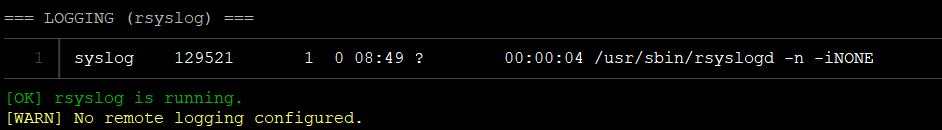

# Inspekcija sistema

Okruženje razvoja skripte i testiranja: **Linux Contabo hosted server**

## Operativni sistem

Skripta proverava da li postoji neka od datoteka: `/etc/os-release`, `/etc/debian_version` ili `/etc/redhat-release` i ispisuje sadržaj sa detaljima operativnog sistema. Možemo da primetimo da je `24.04.3 Noble Numbat` jedna od novijih verzija u vreme pokretanja ove skripte.

## Kernel

Informacije o kernelu je moguće dobiti komandom `uname -a` koji ispisuje i informaciju o verziji kernela. Na web stranici [Ubuntu security notices](https://ubuntu.com/security/notices?release=noble) možemo da vidimo poslednje upozorenja i prijavljene pretnje kako bismo ih otklonili.

Vreme rada servera dobijamo komandom `uptime`. Ako server radi duže od 30 dana, dobra praksa je proveriti da li postoji *update* ili *patch* za kernel i restartovati server.

## Upravljanje vremenom

Skripta izvršava `timedatectl` čime pored vremenske zone ispisuje i da li je NTP servis podešen/detektovan. U ispisu vidimo da je sistemski sat sinhronizovan. Skripta takođe proverava da li server može da se konektuje na bilo koji *peer* pomoću `ntpq -p -n`.

Vidimo da server ne koristi `NTP` za sinhronizaciju nego noviji `ntpd` i da komunicira sa barem jednim *peer-om*.

## Instalirani paketi

Kompletna lista paketa dobijena pomoću `dpkg -l` može da bude nepregledna i zato skripta filtrira ovaj ispis ručno instaliranim paketima (`apt-mark showmanual`). Na ovaj način administrator može da uoči pakete koji više nisu potrebni ili zahtevaju ažuriranje.

## Logovanje

Skripta proverava da li se koristi `rsyslog` i čita `/etc/rsyslog.conf` da bi proverio da li je podešen *remote logging* (linije koje počinju sa **@**).

