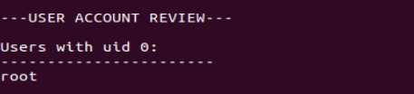
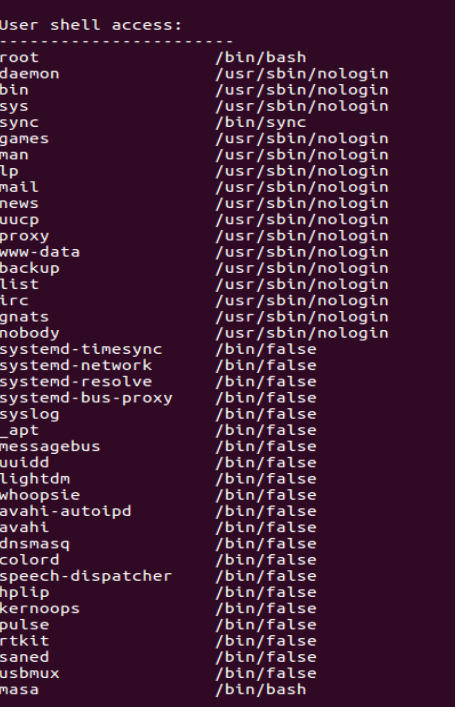
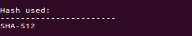
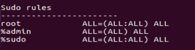

## User Review
Prva funkcionalnost skripte je provera koji korisnici imaju *uid 0*. Generalno jedini korisnik koji bi trebao da ima *uid 0* je *root*. *Root* nalog ima neograničen pristup sistemu i sve privilegije. Ukoliko ima više takvih naloga, sistem postaje manje bezbedan. 

Bezbednosni rizici:
- povećana površina napada, svaki *root* nalog označava jos jednu potencijalnu tačku ulaza u sistem
- rizik od malware-a, ukoliko je korisnik ulogovan na nalogu sa *root* pristupom u trenutku kada pokupi neki maliciozni program, taj program može da iskoristi *root* privilegije kroisnika i postaje opasniji
- sistemska šteta, ukoliko je neki korisnik ulogovan kao *root*, može lako da napravi namernu ili nenamernu štetu na sistemu brisanjem sistemskih fajlova

Pokretanjem, vidimo da je jedini korisnik sa *uid 0* - *root*, što je dobro. 

Ukoliko korisnik primeti još neki nalog, trebao bi da mu promeni *uid* i *gid* ili da ga obriše. 

---
Druga funkcionalnost je provera koji korisnici imaju *shell* i koji nemaju. Ograničenje pristupa *shell*-u će osigurati da korisnik ne može da se konektuje i izvrši komande na sistemu. 

Pokretanjem dobijamo ispis svih korisnika i njihov pristup *shell*-u, korisnici sa */bin/bash* ili */bin/sh* imaju pristup, dok ostali nemaju.

---

Treća funkcionalnost nam govori koji algoritam se koristi za *hash*-iranje lozinki korisnika. Na modernim linux sistemima preporuka je da se izbegavaju *DES* i *MD5* algoritmi. *DES* ograničava dužinu šifre na 8 karaktera i lako se dešifruje, dok je *MD5* podložniji *brute force* napadima od ostalih algoritama. Ukoliko napadač uspe da dođe do šifre, dobija pristup nalogu i samom sistemu, zato je bitno imati jaku šifru i koristiti dobar algoritam. 

---

Četvrta, i poslednja, funkcionalnost nam prikazuje *sudo* pravila. 

Sa ispisa možemo videti pristupe i restrikcije korisnika:
 - **root** (*root user*) - može sa bilo kog *host*-a, da izvrši bilo koju naredbu kao bilo koji korisnik i iz bilo koje grupe, bez restrikcija
 - **%admin** (bilo koji korisnik iz *admin* grupe) - može sa bilo kog *host*-a, da izvrši sve komande kao bilo koji korisnik (standard na starijim *Ubuntu* sistemima)
 - **%sudo** (bilo koji korisnik iz *sudo* grupe) - može sa bilo kog *host*-a, da izvrši sve komande kao bilo koji korisnik i iz bilo koje grupe

Generalno, treba ograničiti pristup privilegija korisnika na minimum (dati im samo ono što im treba) i ne treba davati svim korisnicima dozvolu da izvrše bilo koje komande bez unosa lozinke. Prevelike privilegije korisnika takođe daju te privilegije i napadačima ukoliko dođe do kompromizovanja naloga. 
