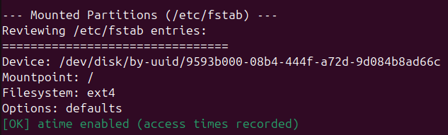
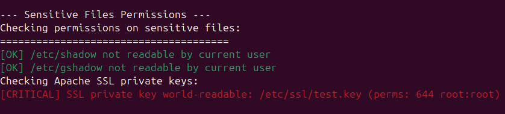
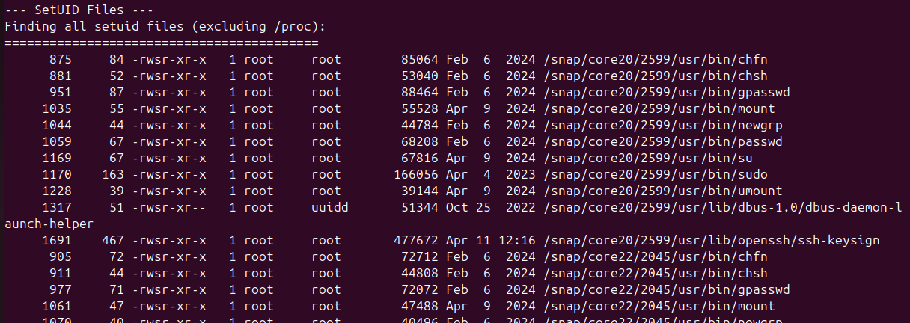
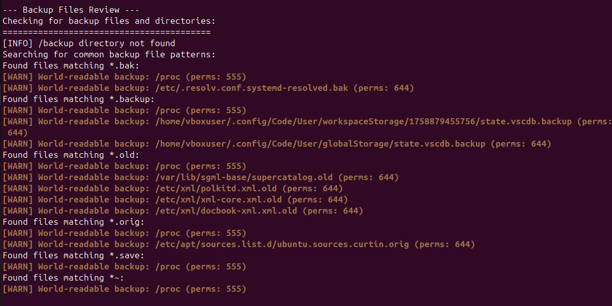

# FileSystem Security Audit

Okruženje za razvoj i testiranje skripte: **Linux VirtualBox VM (Ubuntu)**

## Montirane particije

Skripta analizira datoteku `/etc/fstab`, koja definiše kako su particije montirane na sistemu. Proverava se da li su za kritične direktorijume, kao što su `/tmp` i `/home`, korišćene odgovarajuće bezbednosne opcije.

Uočavamo da sistem koristi podrazumevane opcije bez `noatime` flag‑a, što je korisno jer omogućava praćenje vremena pristupa fajlovima. Međutim, za particiju `/tmp` preporučljivo je dodati opcije `noexec` i `nosuid` kako bi se sprečilo izvršavanje binarnih fajlova i setuid programa iz privremenog direktorijuma.

## Osetljivi fajlovi

Skripta proverava dozvole za kritične sistemske fajlove, kao što su `/etc/shadow` i SSL privatni ključevi. Ovi fajlovi sadrže najosetljivije informacije na sistemu.

Fajl `/etc/shadow` nije čitljiv običnim korisnicima, što je ispravna konfiguracija. Međutim, uočeno je da jedan SSL privatni ključ ima dozvole `644`, što znači da je čitljiv svim korisnicima sistema. To predstavlja ozbiljan bezbednosni rizik, jer privatni ključevi treba da budu dostupni samo vlasniku.

## SetUID fajlovi

Skripta pronalazi sve fajlove sa postavljenim setuid bitom. SetUID fajlovi se izvršavaju sa privilegijama vlasnika, što može predstavljati bezbednosni rizik ako se zloupotrebe.

Pronađen je 41 setuid fajl, uključujući legitimne binarne fajlove kao što su `passwd`, `sudo`, `su` i `mount`. Iako su ove komande neophodne za normalan rad sistema, preporučuje se redovna kontrola kako bi se potvrdilo da su svi setuid fajlovi legitimni i da zaista zahtevaju povišene privilegije.

## World‑writable fajlovi

Skripta traži fajlove koji su write-able od strane bilo kog korisnika na sistemu. Ovo je posebno opasno jer omogućava neovlašćene modifikacije sistemskih ili korisničkih fajlova.

Primećeno je nekoliko fajlova u direktorijumu `/sys/kernel/security/apparmor/` sa dozvolama `666`, što verovatno pripada normalnom radu AppArmor sistema. Međutim, zabrinjavajuće je što postoje skript fajlovi u korisničkim home direktorijumima sa dozvolama `777`, što omogućava bilo kom korisniku da ih menja.

## Backup fajlovi

Skripta proverava prisustvo backup fajlova koji često sadrže iste osetljive informacije kao i originali, ali sa manje restriktivnim dozvolama.

Na sistemu je pronađen veliki broj backup fajlova sa ekstenzijama kao što su `.bak`, `.backup` i `.old`. Neki od tih fajlova, na primer `sources.list.d/ubuntu.sources.curtin.orig`, su čitljivi svim korisnicima. Backup fajlovi konfiguracija mogu otkriti detalje o sistemskom podešavanju koje napadač može iskoristiti.

