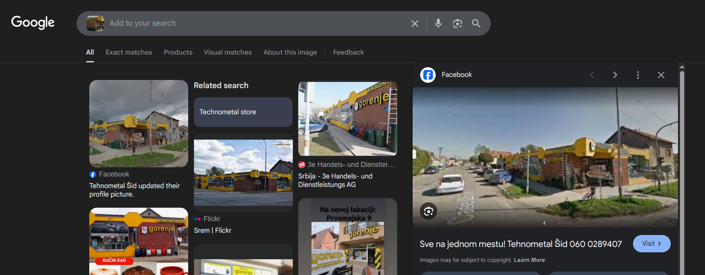
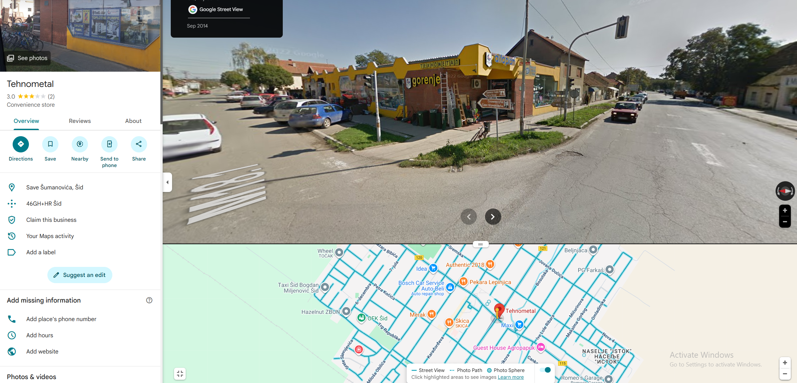

## OSINT CTF

### Squid Game invitation

Početni trag koji imamo je email adresa na pozivnici - `squidgameph1337@gmail.com` i format *flag-a* `NAVY{}`. Običnom Google pretragom ne dolazimo do upadljivih korisničkih naloga (osim Medium članka sa hintom). Sleće je proveren sajt [Have I Been Pwned](https://haveibeenpwned.com/) na kom vidimo da nije bilo curenja informacija za datu adresu.

Prilikom pretrage GitHub naloga, pronađen je korisnik [squidgameph1337](https://github.com/squidgameph1337) koji ima repozitorijum [squidgame](https://github.com/squidgameph1337/squidgame). U datoteci `index.html` pronađen je *flag* `NAVY{h4v3_y0u_3v3r_w4tched_!t?}` koji je inicijalno bio tražen.

### Mape 1

Data je slika Tehnometal prodavnice i format *flag-a* u vidu koordinata. Zaključujemo da je potrebno naći lokaciju na kojoj je uslikana prodavnica. Brzom Google pretragom po datoj slici dobijamo informaciju o gradu u kom se nalazi prodavnica - Šidu.

Kada znamo grad, možemo da pretražimo Google Maps po nazivu prodavnice i gradu, i tako dolazimo do traženih koordinata (takođe primećujemo da je slika uzeta sa Google Maps).

Čitamo pronađene koordinate: `UNS{45.1263749, 19.2291984}`