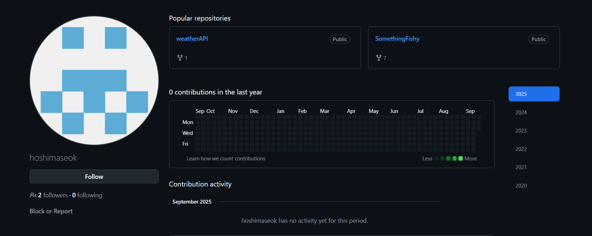
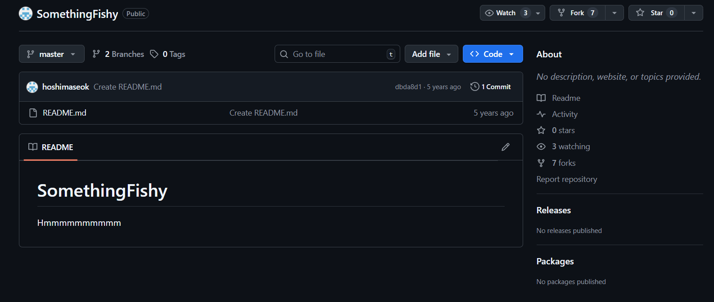
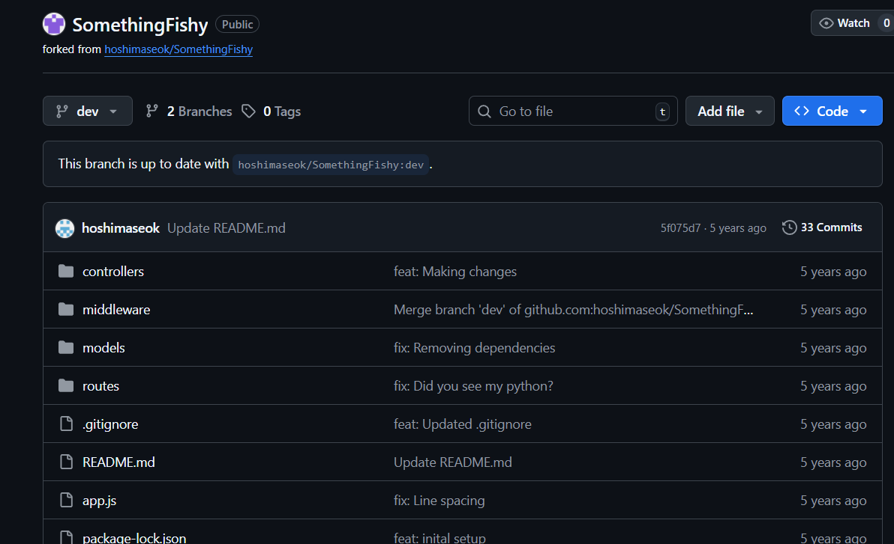
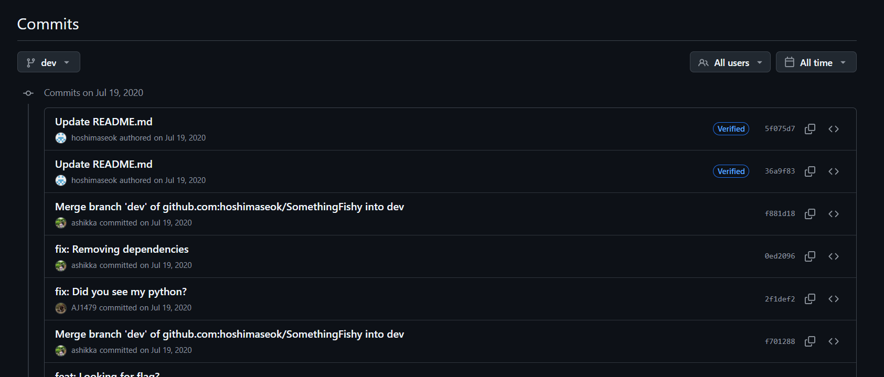
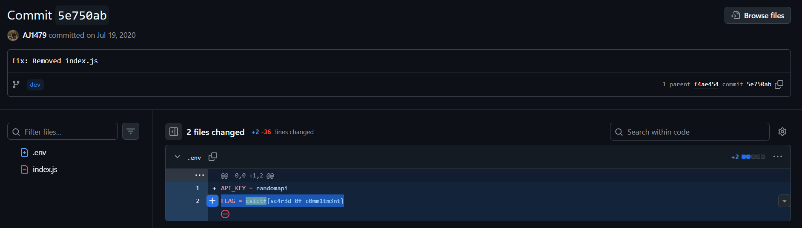
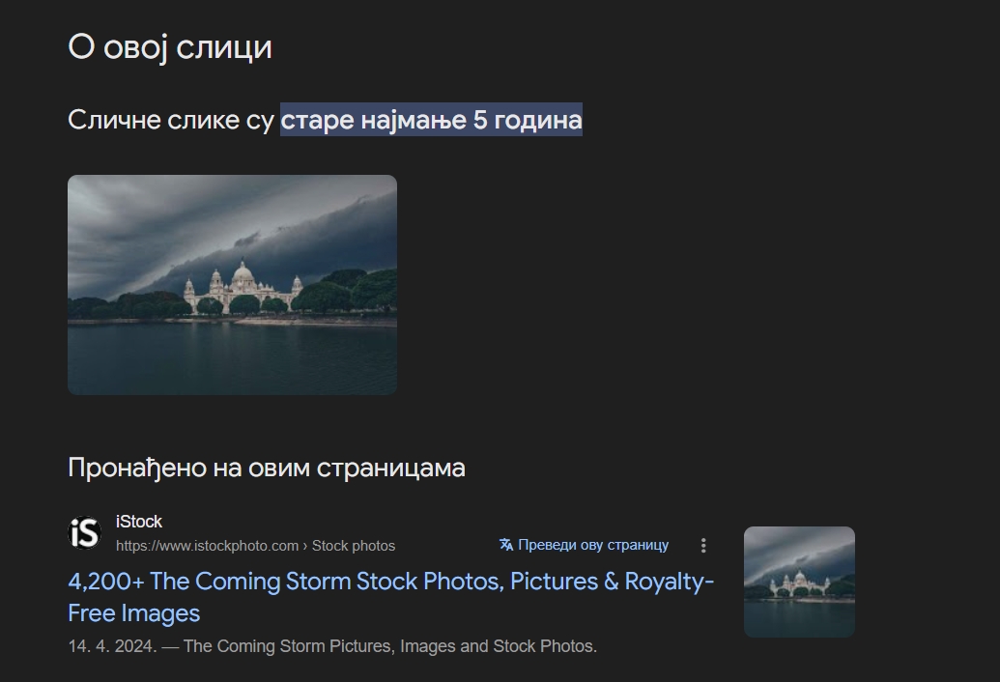
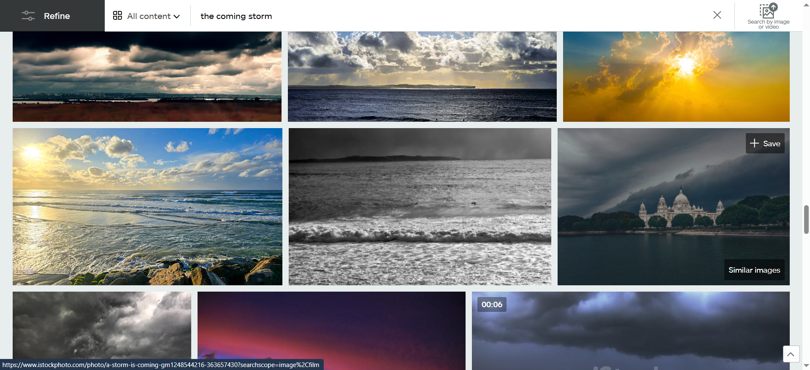
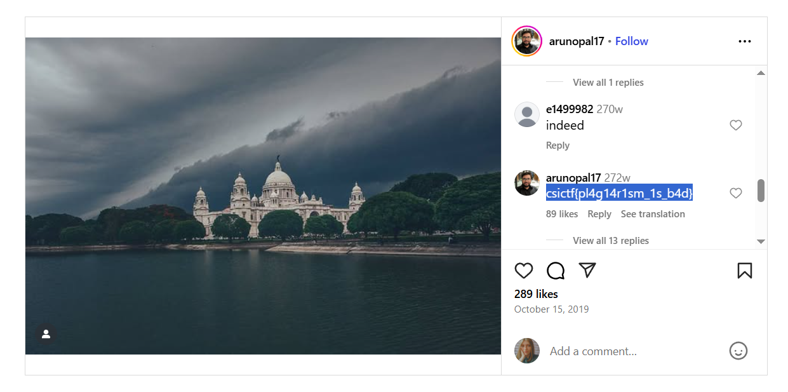

## OSINT

1.**COMMITMENT**

Task: hoshimaseok is up to no good. Track him down.

Zadatak možemo rešiti jednostavnom [*google* pretragom](https://www.google.com/search?q=hoshimaseok&rlz=1C1GCEA_enRS921RS921&oq=hoshimaseok&gs_lcrp=EgZjaHJvbWUyBggAEEUYOTIHCAEQABjvBTIHCAIQABjvBTIKCAMQABiABBiiBDIHCAQQABjvBTIGCAUQRRg8MgYIBhBFGDwyBggHEEUYPNIBCDE1MjZqMGo3qAIAsAIA&sourceid=chrome&ie=UTF-8), tako što ukucamo ime iz teksta zadatka (hashimaseok). *Google* nas odvede do [*github*-a](https://github.com/hoshimaseok) korisnika sa istim imenom. 



Na *github*-u se nalaze dva repositorijuma, jedan od ta dva se ističe imenom pošto se zove [*Something fishy*](https://github.com/hoshimaseok/SomethingFishy) (nešto sumnjivo). 



Na prvi pogled deluje kao da se ne nalazi ništa osim *README* fajla u repozitorijumu, ali ako promenimo granu na [*dev*](https://github.com/manujampana/SomethingFishy/tree/dev) možemo naći više fajlova. 



Prolaskom kroz [*commit*-ove](https://github.com/manujampana/SomethingFishy/commits/dev/) na *dev* grani i pretragom *csictf* na stranicama možemo pronaći flag na *commit*-u [**5e750ab**](https://github.com/manujampana/SomethingFishy/commit/5e750ab0de940e25b56aa82ff7738c859a8c2b92).



Pronađen *flag* je: ```FLAG = csictf{sc4r3d_0f_c0mm1tm3nt}```



---

2. **PIRATES OF MEMORIAL**

Task: The original photographer of this picture commented the flag on his post. Find the flag.


Koristeći *reverse image search* funkciju, možemo pronaći ovu sliku na [*iStock*](https://www.istockphoto.com/search/2/image-film?phrase=the+coming+storm) sajtu.





Na samoj [objavi slike](https://www.istockphoto.com/photo/a-storm-is-coming-gm1248544216-363657430?searchscope=image%2Cfilm) se vidi ime autora: Arunopal Banerjee.


[Pretragom](https://www.google.com/search?q=Arunopal+Banerjee&sca_esv=e2652fd8ccfa33d1&rlz=1C1GCEA_enRS921RS921&sxsrf=AE3TifOhjfxKKdog8vQHlLiy0AN5SURTzQ%3A1758627137411&ei=QYXSaLHxGMbri-gPqZrHiQs&ved=0ahUKEwjxlcXO5O6PAxXG9QIHHSnNMbEQ4dUDCBA&uact=5&oq=Arunopal+Banerjee&gs_lp=Egxnd3Mtd2l6LXNlcnAiEUFydW5vcGFsIEJhbmVyamVlMgcQIxiwAxgnMggQABiwAxjvBTIIEAAYsAMY7wUyCxAAGIAEGLADGKIEMggQABiwAxjvBTILEAAYgAQYsAMYogRIygZQ2QVY2QVwAXgAkAEAmAEAoAEAqgEAuAEDyAEA-AEBmAIBoAIXmAMAiAYBkAYGkgcBMaAHALIHALgHAMIHAzQtMcgHEw&sclient=gws-wiz-serp) imena autora, nalazimo njegov [instagram nalog](https://www.instagram.com/arunopal17/).


Listanjem naloga, možemo naći originalnu [objavu slike](https://www.instagram.com/p/B3oKrLQgpko/), a u komentarima i sam *flag* : ```csictf{pl4g14r1sm_1s_b4d}```.


