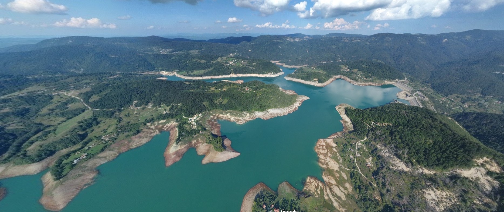
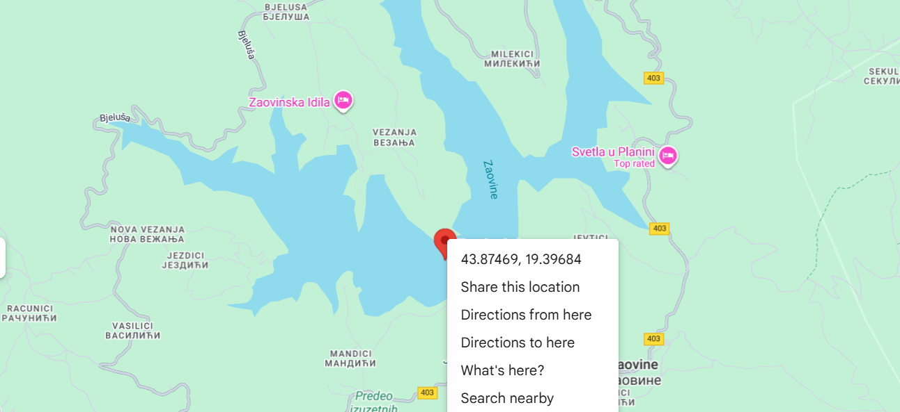
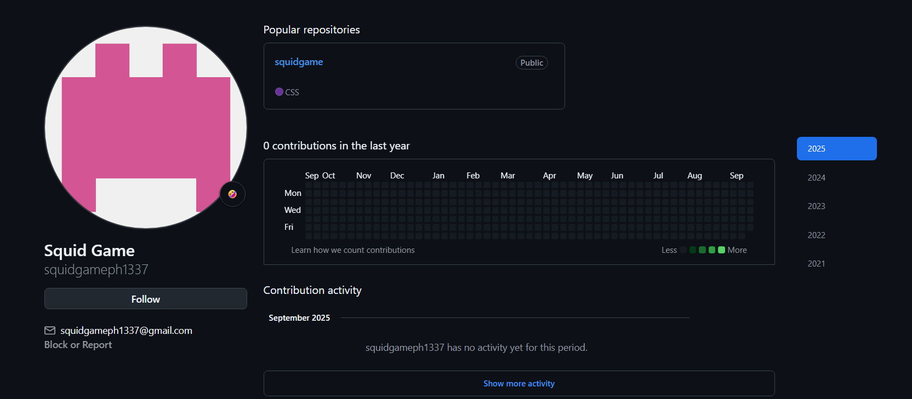
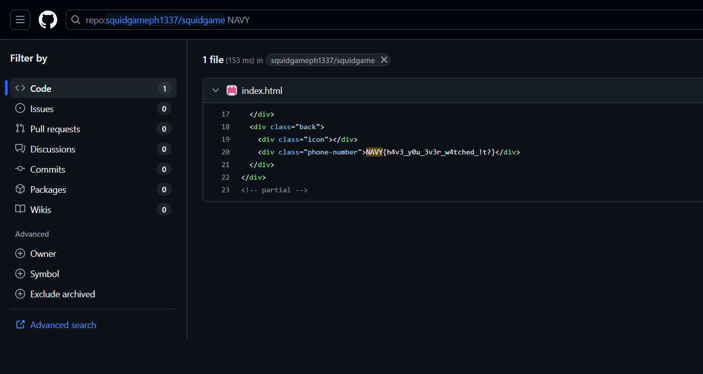

# OSINT

## Mape 2

Na slici je prikazana neka teritorija sa prirodom. Reverse-image searchom možemo da utvrdimo da je u pitanju `Zaovinsko jezero`.
Pošto je format ključa "UNS{XX.XXXXXXX,XX.XXXXXXX}", možemo da utvrdimo da su u pitanju koordinate.

**Ključ**: `UNS{43.8746302, 19.3963231}`

---

## Squid Game Invitation

Na datoj slici možemo da vidimo email: `squidgameph1337@gmail.com`

Pretragom ovog maila na internetu ne dobijamo korisne informacije (izuzev rešenja ovog zadatka ali se pravim da to nisam video).

Međutim, pretraživanjem ovog maila na Github-u možemo da vidimo da postoji korisnik sa tim emailom.

Pošto znamo format flag-a NAVY{}, možemo jednostavno da pretražimo čitav repozitorijum prema tekstu `NAVY` da pronađemo ključ

**Ključ**: `NAVY{h4v3_y0u_3v3r_w4tched_!t?}`
